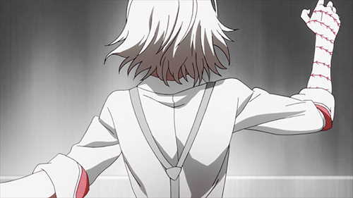

  

    
    
    
  

# Sobre mim:

📚| Cursando Análise e Desenvolvimento de Sistemas Na FATEC Arthur de Azevedo
  ✨| Ensino Médio completo na ETEC Pedro Ferreira Alves
  🖼️| Frontend quase dominado
  🎈| Tentando achar uma linguagem que eu me identifique para o Backend
  🎮| Adoro jogar, ler e desenhar no meu tempo livre

# Nível de Habilidade

🟢| HTML/CSS
  🟡| Python
  🟠| JavaScript
  🟠| PhP

# Mais
🎸| Banda Preferida: System of a Down
🎶| Músia Favorita: Deer Dance - SOAD
🕹️| Custumo jogar Minecraft, Roblox e ZZZ

# Redes Sociais
👾| Discord: axolotlxd.
🎨| Twitter: @AxolotlXisDe (Posto meus Desenhos aqui!)
💬| Contato/Whatsapp: (19) 99431-1238
